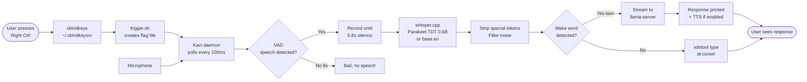
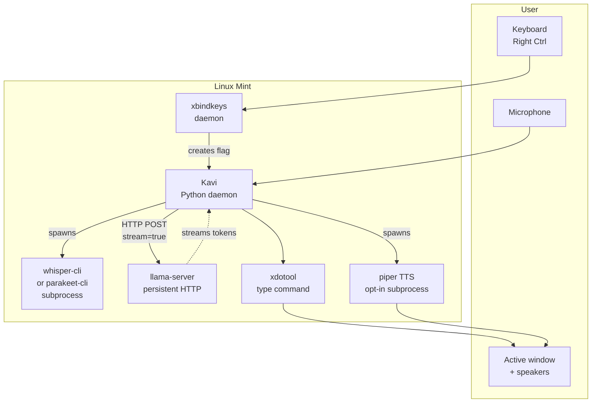
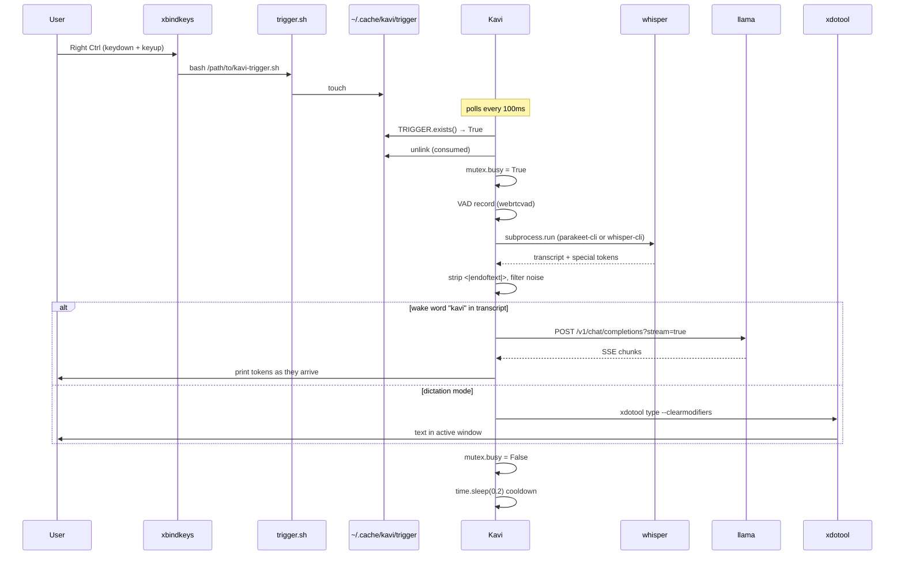
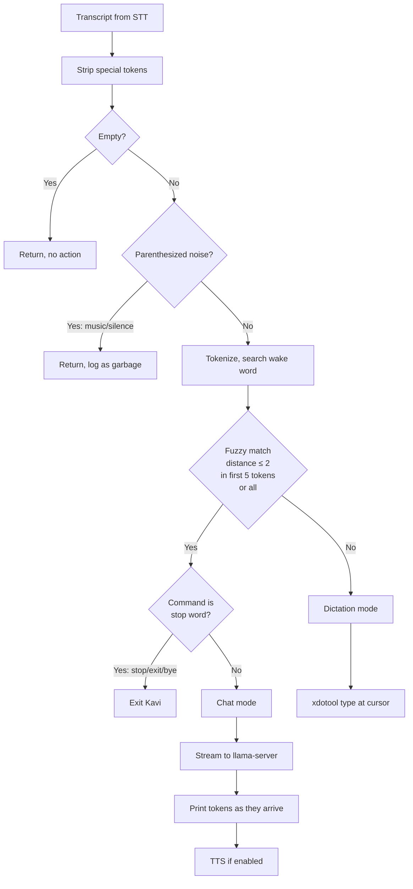
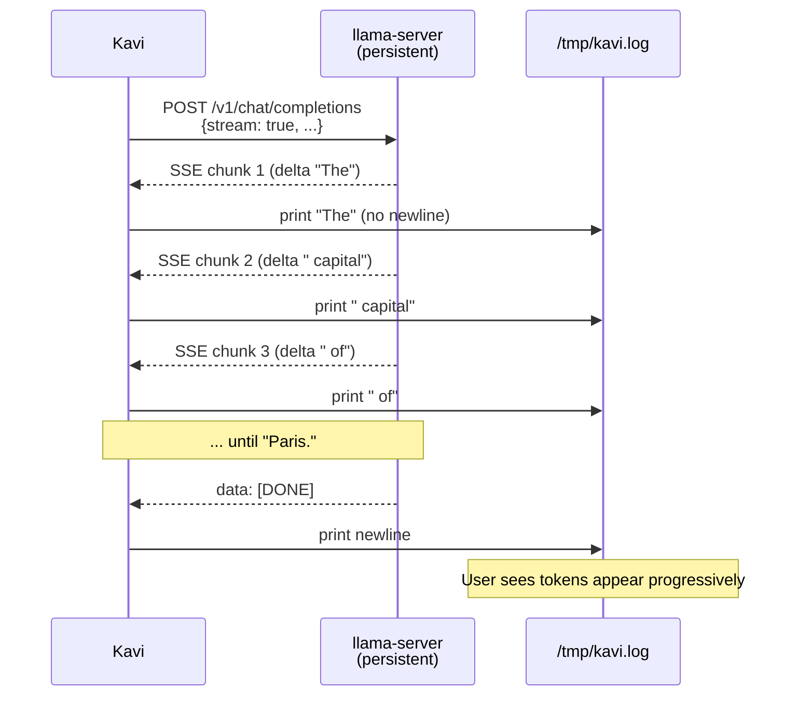
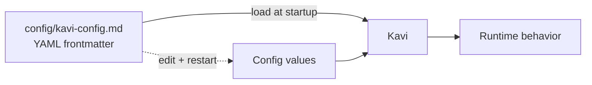

# Architecture — Voice Assistant

> System diagrams for the voice-assistant project. Mermaid renders in GitHub.

## High-level: hotkey → audio → text

## Process topology

## Hotkey chain (detailed)

## Smart dispatch decision tree

## Streaming LLM response (chat mode)

## Resource profile per cycle

```mermaid
gantt
    title One Kavi cycle (CPU STT, CPU LLM)
    dateFormat X
    axisFormat %s
    section Press
    VAD record (until silence) :a1, 0, 2000
    section STT
    whisper-cli load model :a2, after a1, 800
    whisper-cli inference :a3, after a2, 1500
    section Dispatch
    Wake word check :a4, after a3, 10
    xdotool type (dictation) :a5, after a4, 200
    section Cooldown
    Sleep 0.2s :a6, after a5, 200
    section OR (chat)
    llama-server first token (CPU) :b2, after a4, 600
    llama-server stream complete (50 tokens) :b3, after b2, 20000
```

## Skill-driven config (intelligence layer)

Tunable via skill, no Python edit:
- `wake_word` (default: "kavi")
- `fuzzy_max_distance` (default: 2)
- `wake_word_search_tokens` (default: 5)
- `wake_word_search_all` (default: true)
- `vad_aggressiveness` (0-3, default: 1)
- `end_silence_sec` (default: 0.8)
- `bail_after_silence_sec` (default: 8)
- `sample_rate` (16000), `frame_ms` (30)
- `max_utterance_sec` (30)
- `gain_warning_threshold_pct` (15)

## Components and their data

| Component | Size | Where it lives | Notes |
|---|---|---|---|
| whisper base.en | 140 MB | `~/.cache/whisper.cpp/` | Fallback STT |
| Parakeet TDT 0.6B v3 | 1.2 GB | `~/.cache/parakeet/ggml-model.bin` | Default STT (more accurate) |
| Qwen 2.5 1.5B Instruct Q4_K_M | 1.07 GB | `~/.cache/llama.cpp/` | LLM for chat |
| Piper voice (en_US-lessac-medium) | ~60 MB | fetched separately, opt-in | TTS, opt-in |
| Remote VM | n/a | not deployed | Optional remote hosting, evaluated and rejected (see verdict below) |

## What's local vs what could be remote

| Component | Local (laptop) | Remote (small cloud VM) | Decision |
|---|---|---|---|
| Audio capture (pw-cat) | yes | no | Must be local (mic) |
| VAD (webrtcvad) | yes | no | Lightweight, must be local |
| STT (parakeet-cli / whisper-cli) | yes | yes | Local is faster. Remote option untested. |
| LLM (llama-server) | yes (now) | yes | Local works. Remote would be slow (CPU-only VM, no GPU). |
| TTS (piper) | yes | no | Audio output, must be local |
| xdotool | yes | no | Window injection, must be local |
| xbindkeys | yes | no | Keyboard input, must be local |

**Verdict:** Everything is local. The "remote" option is technically possible but not worth pursuing (a CPU-only 2-vCPU cloud VM is 5-10x slower than the laptop GPU for this workload).
